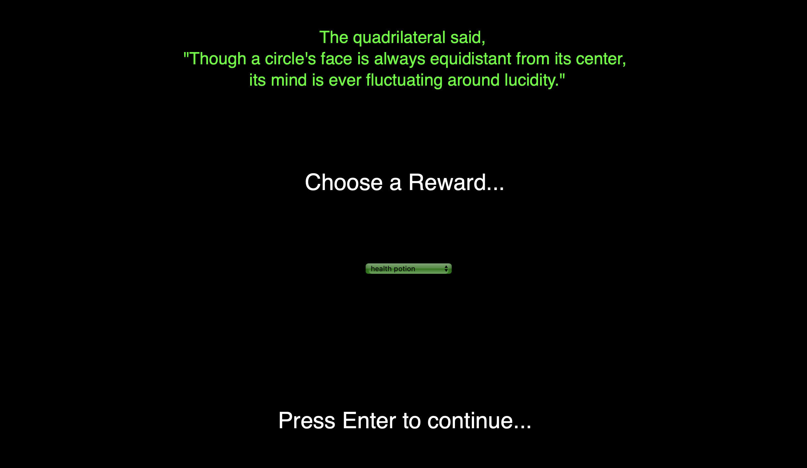
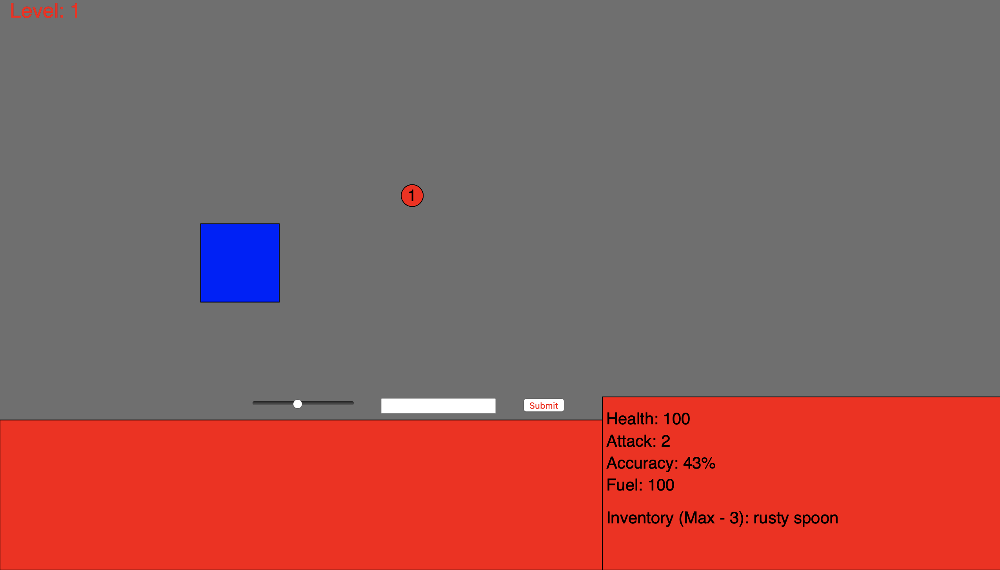

# ShapeNarrative
This Website was made with P5 and allows you to play through an adventure narrative as a questing square in a land of circular heathens.

Rules:
1. Enter commands (attack/use/drop) followed by exactly one space and then the target that you are acting on. Click the submit button when you wish to act on a command.
1. Watch both your health and your fuel wisely. They will be depleted for every action you take and if either drop to zero, the circles will reign victorious.
1. Collect loot by selecting an item from the drop-down menu and pressing enter to continue to the next level.

Note: The texts appearing after levels 1, 2, and 4 are all adapted directly from Thomas Lambdin's translation of the gnostic Gospel of Thomas.

